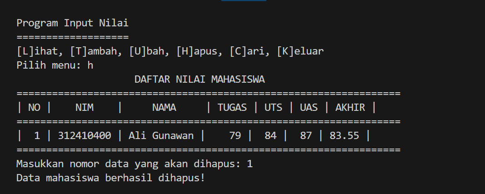

# LAPORAN PRAKTIKUM 6
DAFTAR ISI
==========
- [LAPORAN PRAKTIKUM 6](#laporan-praktikum-6) 
    - [PSEUDECODE PROGRAM DATA MAHASISWA](#pseudecode-program-data-mahasiswa)
    - [FLOWCHART DATA MAHASISWA](#flowchart-data-mahasisiswa)
    - [KESIMPULAN](#kesimpulan)

## PSEUDECODE PROGRAM DATA MAHASISWA

### Step 1 : Inisialisasi Data
Tambahkan variabel data_nilai sebagai list kosong yang digunakan untuk menyimpan data mahasiswa, setiap elemen dalam list adalah dictionary yang berisi informasi mahasiswa, seperti NIM, Nama, Nilai Tugas, Nilai UTS, Nilai UAS, dan Nilai Akhir yang akan diinputkan :

### Step 2 : Fungsi lihat_data
Fungsi ini digunakan untuk menampilkan daftar nilai mahasiswa :
- Jika data_nilai kosong, akan muncul pesan "Tidak Ada Data Mahasiswa".
- Jika data_nilai berisi data, ditampilkan dalam bentuk tabel, tabel akan berisikan data yang sudah diinputkan oleh user NIM, Nama, Nilai Tugas, Nilai UTS, Nilai UAS, dan Nilai Akhir.

### Step 3 : Fungsi tambah_data
Fungsi ini digunakan untuk menambahkan data nilai mahasiswa ke dalam data_nilai. Langkah-langkahnya, Meminta input dari pengguna untuk NIM, Nama, Nilai Tugas, Nilai UTS, dan Nilai UAS, menghitung nilai akhir dengan bobot (Tugas: 30%, UTS: 35%, UAS: 35%), menambahkan data mahasiswa dalam bentuk dictionary ke list data_nilai. Perintah .append berfungsi untuk menambahkan data/memasukan tambahan data baru ke yang sudah disediakan :

### Step 4 : Fungsi ubah_data
Fungsi ini digunakan untuk mengubah data mahasiswa berdasarkan nomor yang dipilih menampilkan data mahasiswa dengan lihat_data serta meminta pengguna memilih nomor data yang ingin diubah, hal ini mencakup semua data dari NIM, Nama, Nilai Tugas, Nilai UTS, dan Nilai UAS yang diubah, namun ada 2 kondisi dalam kasus ini :
- Jika nomor tidak valid, tampilkan pesan "Data tidak ditemukan".
- Jika valid, memperbarui data dengan input baru.

### Step 5 : Fungsi hapus_data
Fungsi ini menghapus data mahasiswa dari data_nilai yang sudah tercantumkan datanya pada tabel. outputnya akan menampilkan daftar data dan meminta nomor data yang akan dihapus. Jika nomor valid, data dihapus dengan del :

### Step 6 : Fungsi cari_data
Fungsi ini mencari data mahasiswa berdasarkan nama yang sudah tertera/data pada tabel data dengan menggunakan list comprehension untuk mencari nama yang cocok (case-insensitive), jika ditemukan akan menampilkan data mahasiswa jika tidak, menampilkan pesan "Data tidak ditemukan" :

### Step 7 : Main Loop
Loop ini merupakan antarmuka utama program selanjutnya akan menampilkan menu pilihan berdasarkan input pengguna, pilihannya yaitu:
- L: Memanggil lihat_data.
- T: Memanggil tambah_data.
- U: Memanggil ubah_data.
- H: Memanggil hapus_data.
- C: Memanggil cari_data.
- K: Keluar dari program.

Jika input tidak valid, menampilkan pesan "Menu tidak valid".

### Step 8 : Run Program
Tahap akhir adalah uji coba code program yang sudah dibuat dengan mencoba berbagai kemungkinan yang ada.
#### Bagian 1 
  pertama pengguna diminta untuk mencoba melihat tabel dengan input 'L' agar pengguna dapat memastikan data keadaan kosong,maka data akan menampilkan isi tabel masih belum ada datanya :

#### Bagian 2
selanjutnya tambahkan data nilai mahasiswa pada tabel dengan menginputkan T untuk menambahkan data nilai.

Tambahkan data nilai :
    - NIM : 312410400
    - Nama : Ali Gunawan
    - Nilai Tugas : 78
    - Nilai UTS : 85
    - Nilai UAS : 89

#### Bagian 3
Selanjutnya, pengguna dapat menginput kembali dengan 'L' untuk melihat daftar nilai pada tabel yang telah pengguna input sebelumnya yang sudah menambahkan data nilai,maka data akan terlihat pada isi tabel :

#### Bagian 4
Masuk kondisi keempat kita akan coba mengubah data, ada data yang salah diinputkan pada Nilai UTS dan Nilai UAS, Nilai UTS 85 diubah menjadi 80 dan Nilai UAS 79 diubah menjadi 89, sebelum itu inputkan U untuk mengubah maka akan ditampilkan daftar nilai tabel dan diminta untuk memasukan nomor yang ingin diubah data nilai -nya. User diminta memasukan kembali data valid yang akan diubah.

- kita coba memasukan data berikut :
    - NIM : 312410400
    - Nama : Ali Gunawan 
    - Nilai Tugas : 79
    - Nilai UTS : 84
    - Nilai UAS : 87

#### Bagian 5
Setelah itu pengguna dapat mencoba melihat hasil pada tabel dengan menginputkan L untuk lihat apakah daftar/data nilai sudah berubah sesuai yang sudah diinputkan sebelumnya.

#### Bagian 6
Kemudian pengguna dapat mencari hasil sebuah data nilai seorang mahasiswa namun karena banyak nya data mungkin membuat kita tidak tau dimana letak nya, namun dengan menginputkan C sebagai perintah untuk mencari akan memudahkan user, setelah menginputkan C user diminta memasukan nama yang ingin dicari, setelah sudah maka akan muncul nama tersebut dalam tabel.

#### Bagian 7
Lalu pengguna dapat mencoba menghapus sebuah data nilai mahasiswa dengan menginputkan H sebagai hapus user diminta memasukan sebuah nomor urut yang akan dihapus data nilai mahasiswa.

#### Bagian 8
Setelah dihapus pengguna dapat melihat hasil input daftar/data nilai mahasiswa yang sudah dihapus pada tabel apakah sudah tidak ada atau masih ada, karena anda hanya menginputkan 1 data nilai saja maka output yang akan tampil adalah sebagai berikut.

#### Bagian 9
Jika semua data atau program input sudah selesai semua,pengguna dapat menginputkan K untuk keluar dari progam.

## FLOWCHART DATA MAHASISWA

### Step 1
Langkah pertama,masuk dengan perintah mulai dalam sebuah program atau alur.

### Step 2
Menampilkan opsi pilih menu:(L)ihat, (T)ambah, (U)bah, (H)apus, (C)ari, (K)eluar:

### Step 3
Pengunaan Decision bagi penguna untuk memilih opsi pilih menuyang diinginkan:

### Step 4
Jika pengguna memilih tambah_data, input data berupa NIM,Nama,Nilai Tugas,UTS,UAS. setelah data diinput kemudian data akan disimpan oleh progrsm:

### Step 5
Pengguna memilih lihat_data, program akan menampilkan data yang telah ditambahkan. Jika tidak ada data menampilkan "Tidak Ada Data" dan jika ada data akan ditampilkan:

### Step 6
Jika memilih ubah_data, program akan meminta pengguna untuk mamilih data yang akan diubah. setelah diubah data akan diperbarui:

### Step 7
Jika memilih hapus_data, program meminta pengguna memilih data yang akan dihapus. setelah dihapus perubahan disimpan oleh sistem:

### Step 8
Jika pilih cari_data, pengguna meminta program untuk mencari data berdasarkan NIM dan Nama lalu tampilkan:

### Step 9
Program akan menampilkan Output nilai akhir data mahasiswa. jika pengguna memilih "(K)eluaar" maka program selesai:

### Step 10
Program berakhir:

## KESIMPULAN
Dengan program data nilai mahasiswa ini merupakan implementasi sederhana untuk mengelola nilai mahasiswa menggunakan struktur data Dictionary di Python. Dengan adanya menu interaktif, pengguna dapat dengan mudah menambah, mengubah, menghapus, dan mencari data mahasiswa. Program ini juga menghitung nilai akhir berdasarkan komponen nilai yang telah ditentukan. Penggunaan Dictionary mempermudah dalam penyimpanan dan pengambilan data dengan efisien.